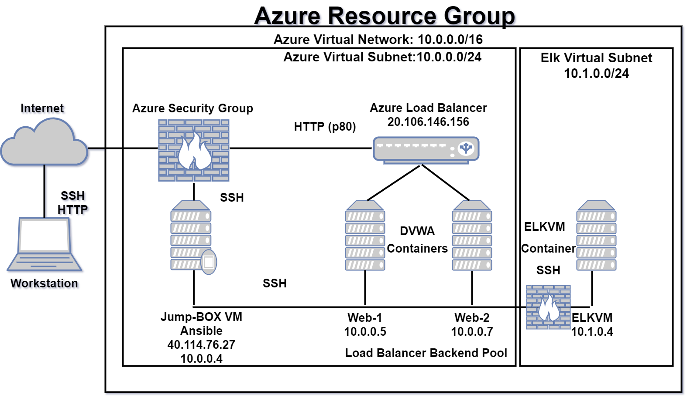

## Automated ELK Stack Deployment

The files in this repository were used to configure the network depicted below.

These files have been tested and used to generate a live ELK deployment on Azure. They can be used to either recreate the entire deployment pictured above. Alternatively, select portions of the pentest.yml file may be used to install only certain pieces of it, such as Filebeat.

- [Pentest Script](Ansible/pentest.yml)

This document contains the following details:
- _Description of the Topology_
- _Access Policies_
- _ELK Configuration_
- _Beats in Use_
- _Machines Being Monitored_
- _How to Use the Ansible Build_

## Description of The Topology

The main purpose of this network is to expose a load-balanced and monitored instance of DVWA, the D*mn Vulnerable Web Application.

- _Load balancing ensures that the application will be highly accessible, in addition to restricting traffic to the network._
- _What aspect of security do load balancers protect?_ _The aspect of security that a load balancer helps protect is the accessibility of the network fram a DDOS attack._ 
- _What is the advantage of a jump box?_ _The advatage of a jumpbox is to give access to a single user from a single node that can be secured and monitored._ 

Integrating an ELK server allows users to easily monitor the vulnerable VMs for changes to the applications and system system logs.
- _What does Filebeat watch for?_ _Filebeat monitors the log files or locations that you specify._
- _What does Metricbeat record?_ _Metricbeat periodically collects and records both metrics and stats from the operating system and from services running on the servers._

The configuration details of each machine may be found below.
_Note: Use the [Markdown Table Generator](http://www.tablesgenerator.com/markdown_tables) to add/remove values from the table_.

| Name     | Function | IP Address | Operating System |
|----------|----------|------------|------------------|
| Jump Box | Gateway  | 10.0.0.1   | Linux            |
| Web-1    |  VM      | 10.0.0.5   | Linux            |
| Web-2    |  VM      | 10.0.0.7   | Linux            |
| Elk Server| VM      | 10.1.0.4   | Linux            |

## Access Policies

The machines on the internal network are not exposed to the public Internet. 

Only the Jump Box machine can accept connections from the Internet. Access to this machine is only allowed from the following IP addresses:
- _Whitelisted IP address:_ _My personal IP address!_

Machines within the network can only be accessed by Jump Box SSH.
- _Which machine did you allow to access your ELK VM?_ _The Jumb Box was the only machine allowed access to the Elk VM._ 
- _What was its IP address?_ _The IP address is: 40.114.76.27_

A summary of the access policies in place can be found in the table below.

| Name     | Publicly Accessible | Allowed IP Addresses |
|----------|---------------------|----------------------|
|Jump Box  | Yes                 | 40.114.76.27         |
|Web-1     | Yes                 | 10.0.0.5             |
|Web-2     | Yes                 | 10.0.0.7             |
|ElkVM     | No                  | 10.1.0.4             | 
## Elk Configuration

Ansible was used to automate configuration of the ELK machine. No configuration was performed manually, which is advantageous because...
- _What is the main advantage of automating configuration with Ansible?_ _The main advantage of automating configuration with Ansible is that is the simplicity of use for automation provisioning, configuration management, and application deployment._

## The Playbook Implements the Following Tasks
- _First create a new Virtal Network in Azure in the same resource group, but under a different region, because of resource allocation._
- _Second step is to setup a peer-to-peer network connection between the Virtual Networks._
- _Third step is to create a Virtual Machine that cosist of no less 2CPU's and 4Gb of Ram inside of the new Virtual Network._ _Set the new Virtual Machine to Ansible 's hosts file in the provisioner Virtual Machine._
- _Now create the Ansible Playbook that installs Docker and configures a Elk container._
- _Lastly we set all restrictions to no access to the Elk Virtual Machine._ 

The following screenshot displays the result of running `docker ps` after successfully configuring the ELK instance.

### Target Machines & Beats
This ELK server is configured to monitor the following machines:
- _The IP addresses of the machines I am monitoring are:_ _10.0.0.5; 10.0.0.7;_

We have installed the following Beats on these machines:
- _Filebeats and Metricbeats_

These Beats allow us to collect the following information from each machine:
- _Filebeat monitors the log files or locations that you specify, collects log events, and forwards them either to Elasticsearch or Logstash for indexing._ _Example: When you start Filebeat, it starts one or more inputs that look in the locations you’ve specified for log data. For each log that Filebeat locates, Filebeat starts a harvester._
- _Metricbeat takes the metrics and statistics that it collects and ships them to the output that you specify, such as Elasticsearch or Logstash._ _Example: Metricbeat can insert the collected metrics directly into Elasticsearch or send them to Logstash, Redis, or Kafka._

## Using the Playbook
In order to use the playbook, you will need to have an Ansible control node already configured. Assuming you have such a control node provisioned: 

SSH into the control node and follow the steps below:
- _Copy the ansible host file to /etc/ansible_
- _Update the host file to include the internal IP adresses of the the Elk Server, Web-1, and Web-2 servers._
- _Run the playbook, and navigate to Kibana to check that the installation worked as expected._

## PlayBook Contiued
- _Which file is the playbook? The playbook Roles file._ 
- _Where do you copy it?_ _You copy it to the Web Virtual Machine's._
- _Which file do you update to make Ansible run the playbook on a specific machine? You update the line in your ansible scripts on the `hosts` line of the file to make the Ansible run the playbook._ 
- _How do I specify which machine to install the ELK server on versus which to install Filebeat on?_ _To specify which machine to install the Elk server on is specified in the `hosts` file._
- _Which URL do you navigate to in order to check that the ELK server is running?_ _You will need to the navigate to http://20.119.207.60:5601/app/kibana to access Kibana on the Elk server website.

_The specific commands the user will need to run to download the playbook, update the files, etc._ 
- _$ansible-playbook filebeat-playbook.yml_